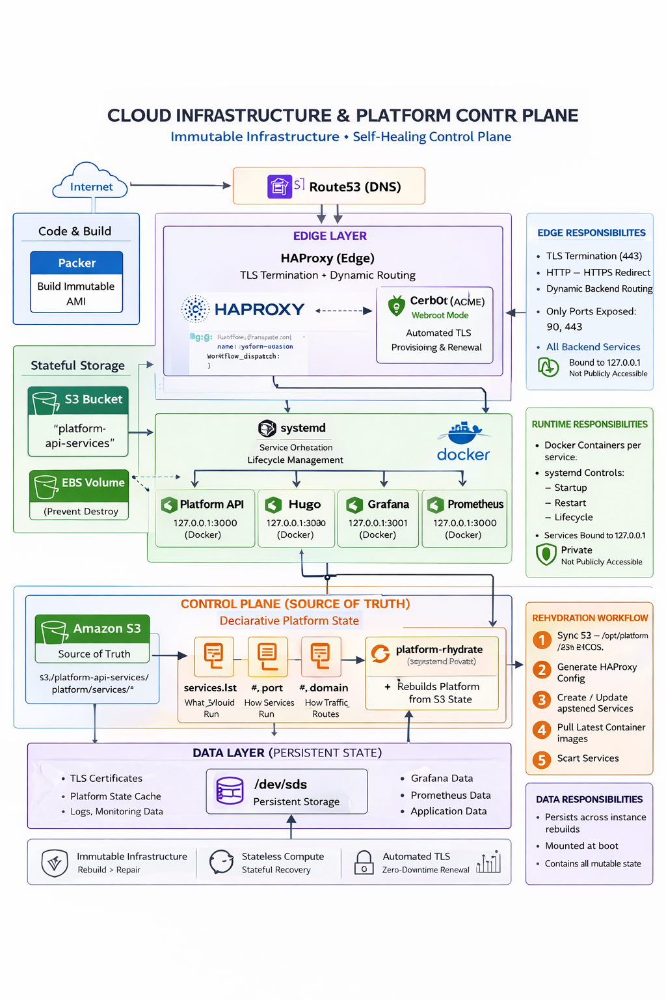

# Platform Foundation

### *Stateless Infrastructure + Self-Rehydrating Control Plane*

A production-style platform that combines **immutable infrastructure**, **declarative runtime state**, and a **self-rehydrating control plane** to rebuild its runtime deterministically from a single source of truth.

This project evolves traditional DevOps into a **minimal platform layer (PaaS-like)** where routing, services, TLS assets, and runtime configuration are reconstructed automatically and predictably.

---

## 🚀 Core Principle

> Compute is ephemeral. State is externalized. Runtime can be deterministically reconstructed from durable control plane snapshots.

---

## 🧠 Architecture Overview



+----------------------+  
|      Route53 (DNS)   |  
+----------+-----------+  
           |  
           ▼  
+-------------------------------+  
| HAProxy (Edge)               |  
| TLS Termination + Routing    |  
+-------------------------------+  
           |  
   ---------------- CONTROL PLANE ----------------  
           |  
           ▼  
     S3 (Source of Truth)  
   /platform/services/*  
           |  
           ▼  
   platform-rehydrate (systemd)  
           |  
           ▼  
   Deterministic Rebuild:  
     - systemd units  
     - HAProxy config  
     - TLS certificates  
     - Running containers  
   -----------------------------------------------  
           |  
   ------------------- DATA LAYER ----------------  
           |  
           ▼  
     EBS Volume (persistent state)

---

## 🔧 Technology Stack

* **Packer** — Immutable AMI creation
* **Terraform** — Infrastructure provisioning
* **HAProxy** — Edge routing + TLS termination
* **Docker** — Application runtime
* **systemd** — Service orchestration + lifecycle management
* **Amazon S3** — Declarative runtime state + control plane
* **Amazon ECR** — Container registry
* **Certbot** — Automated TLS lifecycle
* **Prometheus** — Metrics collection
* **Grafana** — Observability + dashboards

---

## 🎯 Platform Capabilities

* Immutable infrastructure (no in-place mutation)
* Declarative service registry via S3
* Deterministic HAProxy config generation
* systemd-managed container lifecycle
* Full platform rehydration from control plane state
* Automated TLS provisioning + renewal
* Private service exposure (127.0.0.1 only)
* Daily off-platform snapshot backups
* Versioned control plane recovery
* Disaster recovery snapshot retention
* Runtime reconstruction from historical state
* Integrated Prometheus + Grafana observability
* Blackbox and node-level monitoring

---

## 🧱 System Design

### Edge Layer (HAProxy)

Handles:

* TLS termination (443)
* HTTP → HTTPS redirection
* Domain-based routing via generated backend maps

---

### Runtime Layer

Each service runs as an isolated Docker container.

systemd provides:

* deterministic service orchestration
* restart guarantees
* dependency ordering
* boot-time recovery

---

### Control Plane (S3)

Defines the desired runtime state:

```
services.list     → enabled services
<service>.port    → runtime binding
<service>.domain  → routing definition
```

Additional persisted state includes:

* TLS certificates
* HAProxy runtime mappings
* recovery metadata
* service registration state

---

## 🔁 Rehydration Workflow

```text
S3 sync
→ generate HAProxy configs
→ generate systemd service units
→ pull container images
→ start services
→ validate HAProxy
→ graceful reload
```

---

## ⚙️ Platform CLI

### Start Platform

```bash
platform up
```

### Graceful Shutdown

```bash
platform down
```

### Deploy Service

```bash
platform deploy <service>
```

### Register Service

```bash
platform register <service> <port> <domain>
```

### Rehydrate Runtime

```bash
platform rehydrate
```

### Health Validation

```bash
platform health
```

### Interactive Shell

```bash
platform shell
```

---

## 🔐 Security Model

* Exposed ports:
  * 80 (redirect only)
  * 443 (TLS termination)

* All backend services bind exclusively to:
  * `127.0.0.1`

* TLS managed automatically via Certbot
* Safe HAProxy validation before reloads
* Zero-downtime certificate renewals
* No direct public container exposure

---

## 🏗 Infrastructure Lifecycle

```text
packer build
→ terraform apply
→ EC2 boot
→ systemd
→ platform-rehydrate
→ runtime restored
```

## Platform Lifecycle

| Workflow | Status |
|---|---|
| Platform Up |  |
| Platform Down |  |
| Hugo CI |  |

---

## 🧠 Platform State Model

### Immutable Compute Layer

* EC2 instances
* AMIs
* system packages
* Docker runtime
* HAProxy binaries

---

### Durable Runtime State Layer

* service registry
* routing definitions
* TLS assets
* HAProxy mappings
* runtime metadata
* backup snapshots

---

## 💾 Backup & Disaster Recovery

Secondary backup bucket:

```
platform-api-services-backup
```

Nightly GitHub Actions create immutable snapshots:

```
snapshots/YYYY-MM-DD/
```

Backups include:

* service registry state
* routing configuration
* TLS certificates
* platform metadata

---

## 🔥 Disaster Recovery Workflow

```text
Primary node destroyed
→ Terraform reprovisions infrastructure
→ Immutable AMI boots
→ platform-rehydrate executes
→ S3 sync restores runtime state
→ systemd recreates services
→ HAProxy rebuilds routing
→ TLS assets restored
→ Platform returns online
```

---

## 📦 Platform Evolution

### Phase 1 — Immutable Foundation
### Phase 2 — Container Runtime
### Phase 3 — Edge Stability
### Phase 4 — Declarative Control Plane (Current)

---

## ⚠️ Current Constraints

* Single-node architecture
* No autoscaling
* No blue/green deployments
* No orchestration clustering
* Limited alerting automation
* No automatic failed-node replacement

---

## 🔜 Next Phase: Production Maturity

* Multi-node runtime architecture
* Health-based traffic routing
* Blue/green deployment workflows
* Centralized alerting
* Runtime reconciliation loops
* Automated node replacement
* Distributed state management

---

## 🧠 Engineering Principles

* Immutability over mutation
* Declarative state over imperative logic
* Stateless compute, stateful recovery
* Rebuild over repair
* Operational determinism
* Automation by default

---

## 📁 Repository Structure

```text
platform-foundation
├── apps/
├── infra/
├── tools/
├── docs/
└── scripts/
```

---

## 📌 Current Status

### Phase 4 — Declarative Control Plane

* deterministic
* rehydratable
* dynamically routed
* externally recoverable
* immutable-infrastructure based

---

## 📦 Proven Runtime Behaviors

* Immutable AMI replacement
* Full node destruction + rebuild
* Runtime reconstruction from S3
* HAProxy safe reload validation
* TLS auto-discovery via certificate directory
* Automated Docker service restoration
* systemd orchestration recovery
* Snapshot-based runtime recovery

---

## 🔁 Runtime Rehydration Sequence

```text
EC2 boot
→ systemd initialization
→ platform-rehydrate
→ S3 runtime sync
→ generate HAProxy mappings
→ generate service units
→ pull container images
→ start containers
→ validate HAProxy
→ graceful reload
```

---

## 🏆 Key Engineering Achievements

* HAProxy runtime include architecture
* Dynamic backend generation
* TLS directory-based SNI loading
* Immutable rebuild validation
* systemd-driven runtime orchestration
* Externalized runtime control plane
* Snapshot-based disaster recovery
* Declarative runtime reconstruction


---
Planning Hugo ARCHITECTURE 

layouts/
├── _default/
│
├── culture/
│   └── list.html
│
├── kb/
│   ├── list.html
│   └── single.html
│
├── platform/
│   └── list.html
│
└── partials/
    └── platform/
        ├── header.html
        ├── footer.html
        ├── culture.html
        ├── news.html
        ├── architecture.html
        └── kb-sidebar.html


---

# 👤 Author

**Derrick C. Onwuachi**  
Cloud / DevOps / Platform Engineer
```

---
